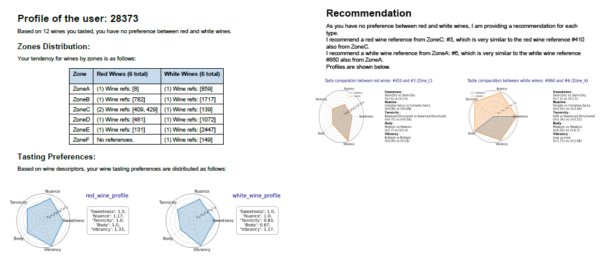

# CBR-AND-RECOMMENDATION-SYSTEM

-   **Author**: Haizea Rumayor Lazkano
-   **Last update**: October 2024

------------------------------------------------------------------------

This GitHub project presents a prototype that leverages `case-based reasoning` to recommend new wines based on the user's wine profile.

## Overview

The project leverages the `UCI Wine Quality Dataset` to build a `case-based recommendation` system that matches users with wines based on their unique preferences.  
The project is structured into two main scripts:
- `create_data_base.py`: Defines key wine descriptors, clusters wines into groups, and simulates user profiles with randomized wine preferences.
- `main.py`: Interacts with users, identifies their preferences, and recommends wines that best match their tastes. The recommendation results are saved in a PDF file.

## Key Features

- **Wine Descriptor Classification**: Each wine is characterized by five key descriptors: Vibrancy, Sweetness, Body, Nuance, and Tannicity and categorized into _low_, _medium_, or _high_ levels.
- **Wine Clustering**: Wines are grouped into clusters, with each cluster representing a distinct wine zone based on similar profile characteristics.
- **User Simulation**: Virtual user profiles are generated, with wines randomly assigned to simulate varied preferences across different users.
- **Personalized Wine Recommendation**: The system creates a user-specific wine profile, compares it with the clustered wines, and recommends the wine that most closely matches the user’s preferences.
- **Recommendation Output**: Results are saved in a PDF file, offering a detailed list of wine suggestions tailored to the user’s taste.

## Project Structure

The project is organized into the following directories and files:

- **files/**: Contains CSV files with quality data for red and white wines.
- **modules/**: Contains modules with functions used throughout the project.
- **src/**: Contains Python scripts that implement the core functionality. `create_data_base.py` and `main.py` are located here.
- **requirements.txt**: Lists the Python packages required to run the project.
- **Dockerfile**: Used to launch the project in a Docker container.

## Branch Information

This project uses two branches for organizing the code and the resulting files:

- **master**: Contains the core project code, including the scripts `create_data_base.py` and `main.py`. It is the branch to work with for making changes to the codebase.
  
- **final_results**: Includes not only the core code but also the generated files and reports. After running `create_data_base.py` and `main.py`, the wine profiles, user preferences, and recommendation PDFs are saved here as an example of the output created by the project.

By checking out the `final_results` branch, you can explore the resulting data and PDFs without having to run the scripts yourself.

## Installation and Run Steps

To get started with this project, please follow these steps:

### Prerequisites

1. **Install Docker**: Ensure Docker is installed on your machine. You can download and install it from the [Docker website](https://www.docker.com/products/docker-desktop).

### Configuration for Matplotlib

To use Matplotlib in a Docker container with GUI support, you'll need to configure X11 forwarding on your Windows machine. Follow these instructions:

1. **Install XLaunch**:
   - Download and install **XLaunch** from the [Xming website](https://sourceforge.net/projects/xming/).
   - Launch XLaunch and choose **"Multiple windows"** when prompted.
   - Set the display number to **0**.
   - Select **"Start No client"**.
   - Choose **"Native OpenGL"**.
   - Check **"No access control"** to allow connections.

2. **Get Your Windows IP Address**:
   - Open Command Prompt and run the following command to find your IP address:
     ```bash
     ipconfig
     ```
   - Note the IPv4 Address (e.g., `192.168.1.100`).

### Building the Docker Image

1. **Navigate to the Project Directory**:
   Open your terminal and navigate to the root directory of the project where the `Dockerfile` is located.

2. **Build the Docker Image**:
   Run the following command to build the Docker image:
   ```bash
   docker build -t wine_app .
   ```
2. **Run the Docker Image**:
    Replace `<ip_address>` with corresponding value:
    ```bash
    docker run --rm -it --env=DISPLAY=<ip_address>:0 -v="$(Get-Location):/app" wine_app
    ```
3. **Navigate to corresponding script and run the script**:
   First, you'll need to create the database using `create_data_base.py`, which involves categorizing wines and simulating users and their wine preferences:
    ```bash
    cd src
    python create_data_base.py
    ```

   Once the database is created, you can run the `main.py` script as many times as needed to generate recommendations:
   ```bash
    cd src
    python main.py
   ```
4. **Retrieve resuts locally**
   The results are saved in the `report` folder within the Docker container. 
   
   To retrieve the PDF file, open a command prompt, identify the running Docker container:
    ```bash
    docker ps
   ```
   Navigate to the Project Directory, and copy the file from the container to your local replacing `<docker_instance>` with corresponding value.
   ```bash
    docker cp <docker_instance>:/usr/local/app/report .
   ```

## Wine Data Preparation and User Simulation (create_data_base.py)

#### 1. Wine Descriptors creation:
- **Descriptor Identification**: Based on wine characteristics, five key sensory descriptors are created. 

  1. **Vibrancy (acidity)**:
     - **Fixed Acidity**: Higher values suggest fresher wines.
     - **Volatile Acidity**: High levels may indicate a vinegary taste.
     - **Citric Acid**: More citric acid indicates livelier wines.
     - **pH**: Low pH indicates freshness; high pH suggests softness.
  
  2. **Sweetness (sugars)**:
     - **Residual Sugar**: High values imply sweetness; low values suggest dryness.
  
  3. **Body (alcohol & density)**:
     - **Alcohol**: Higher content indicates fuller-bodied wines.
     - **Density**: Denser wines suggest richness.
  
  4. **Nuance (chlorides)**:
     - **Chlorides**: Traces of salinity influence taste.
  
  5. **Tannicity (sulphates)**:
     - **Sulphates**: Higher levels increase dryness on the palate.

   **Note**: In cases where a descriptor is derived from more than one variable (e.g., vibrancy and body), each variable represents the same weight.

- **Categorization**: Plotting each wine descriptor and defining the 10th and 90th percentiles allows for the determination of _low_, _medium_, and _high levels_. Each descriptor has its own level representation, which is shown below:

  1. **Vibrancy (acidity)**:
       - **Low**: Liveliness | **Medium**: Live | **High**: Brilliant
  
  2. **Sweetness (sugars)**:
       - **Low**: Dry | **Medium**: Semi-Dry | **High**: Sweet
  
  3. **Body (alcohol & density)**:
       - **Low**: Light | **Medium**: Medium | **High**: Full-Bodied
  
  4. **Nuance (chlorides)**:
       - **Low**: Simple | **Medium**: Complex, Spicy | **High**: Intense
  
  5. **Tannicity (sulphates)**:
       - **Low**: Soft | **Medium**: Balanced, Structured | **High**: Robust

**Note**: The categorized wines are saved in the corresponding red and white files in the `data` folder: `red_wines_categorized.csv` and `white_wines_categorized.csv`.

#### 2. Wine zone mapping

Wines are grouped using the `K-means` algorithm, with the optimal number of clusters determined by the `NbClust` function in R. Once the clusters are obtained, each cluster is mapped to distinct wine zones. For example, if there are 3 clusters, the mapping would look like this:
  - **Cluster 0**: Zone A
  - **Cluster 1**: Zone B
  - **Cluster 2**: Zone C

This means that wines in Cluster 0 would be labeled as Zone A, wines in Cluster 1 as Zone B, and so on. This labeling helps in easily identifying and representing the different wine zones based on their characteristics.

**Note**: The grouped wines are saved in the corresponding red and white files in the `data` folder: `red_wines_clustered.parquet` and `white_wines_clustered.parquet`.

#### 3. Simulates User Profiles with Randomized Wine Preferences

- **User Profile Generation**: Virtual user profiles are created with unique 5-digit codes. The number of users is randomly determined between 5 and 20. Each profile is assigned attributes, including total wine quantity and preferences for red or white wines.

- **Wine Assignment**: Wines are randomly assigned to users based on their preferences. If a user prefers more red wines, a randomized value determines how many additional wines are needed in that category. Then, the wines are distributed in a balanced way across each wine zone until the total number of wines is reached.

For example, a user object may look like this:

```json
{
    "user": "95071",
    "distribution": "more_red",
    "wine_qty": 14,
    "how_more": 2,
    "red_wines": 8,
    "white_wines": 6,
    "red_distribution": [
        {"Zone_A": 1,"Zone_A_rows": [058]},
        {"Zone_B": 1,"Zone_B_rows": [771]},
        {"Zone_C": 2,"Zone_C_rows": [827,915]},
        {"Zone_D": 2,"Zone_D_rows": [1017,475]},
        {"Zone_E": 2,"Zone_E_rows": [86,13]}
    ],
    "white_distribution": [
        {"Zone_A": 1,"Zone_A_rows": [2162]},
        {"Zone_B": 1, "Zone_B_rows": [274]},
        {"Zone_C": 1, "Zone_C_rows": [541]},
        {"Zone_D": 1, "Zone_D_rows": [1804]},
        {"Zone_E": 1, "Zone_E_rows": [734]},
        {"Zone_F": 1, "Zone_F_rows": [1390]}
    ]
}
```

**Note**: The users list is saved as a JSON file named `users_wine_delivery_conf.json` in `data` folder.

## Personalized Wine Recommendation System (main.py)

The **Personalized Wine Recommendation System** prompts the user for their identification. Once the user reference is established, their wine preference profile is created. For instance, if the user indicates a preference for more white wines, the system determines the most favorable wine zone based on this preference. A reference wine is then selected from this zone. Using Euclidean distance, the system identifies wines that are most similar to the reference wine.

Later, various intermediate elements are created to compose the resulting recommendation PDF file, including:

- **Markdown text** composed of a paragraph and table for user profile definition.
- **Radar plots** corresponding to each wine type profile of the user.
- **Recommendation markdown text**, which compares the reference wine with the recommended one.
- **Comparative radar plots** for the recommendations.

**Note**: These elements are saved in the `report_tmp` folder, with each element identified by the user ID and the current date.

The final results are composed of these intermediate elements, generating a PDF file, as illustrated in the accompanying example image.



**Note**: This final result is saved in the `report` folder, identified by the user ID and the current date.